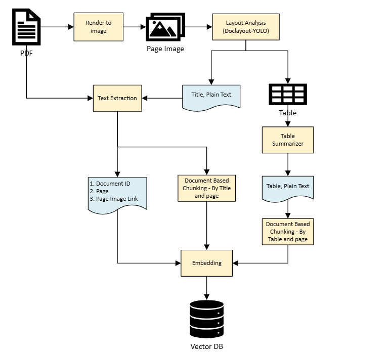
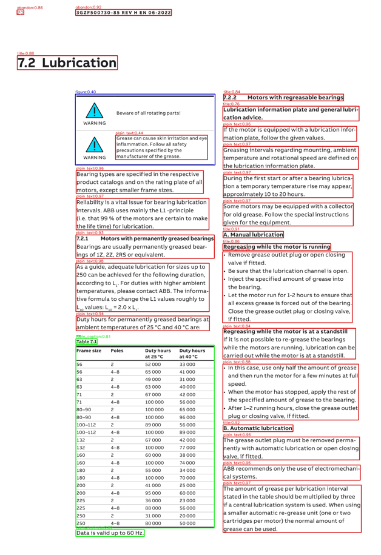
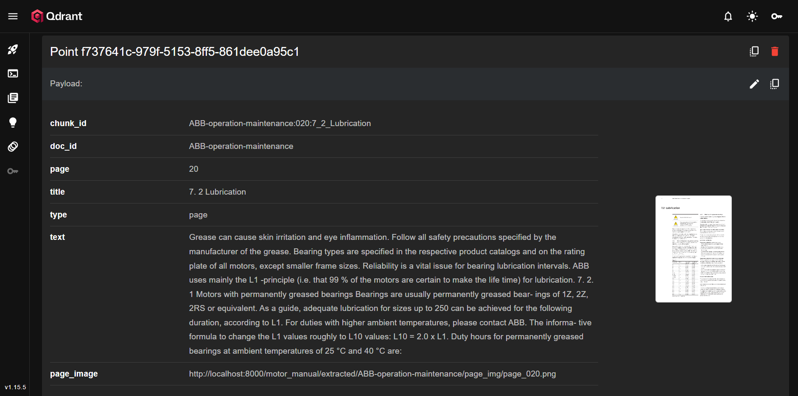

# RAG Pipeline Documentation

A three-stage Retrieval-Augmented Generation (RAG) system for extracting, ingesting, and retrieving information from PDF documents using DocLayout-YOLO for layout analysis and local embeddings.

---
## Architecture Overview




## Pipeline Overview

### **Stage 1: Extract** (`pdf_extract.py`)
Converts PDF pages into structured data using DocLayout-YOLO layout detection.

### **Stage 2: Ingest** (`ingest.py`)
Embeds extracted text and stores vectors in Qdrant with metadata.

### **Stage 3: Retrieve** (`retrieve.py`)
Queries the vector database using semantic search to find relevant context.

---

## Stage 1: PDF Extraction

### Purpose
Extract page-level content from PDFs while preserving document structure (tables, figures, text).

### Key Features
- **Layout Detection**: Uses DocLayout-YOLO to identify tables, figures, charts, titles, and text regions
- **Page-Level Chunking**: One Markdown file per page for granular retrieval
- **Media Extraction**: Saves tables and figures as separate image files
- **Text Masking**: Excludes text from regions occupied by tables/figures to prevent duplication

### Output Annotated Layout



#### Directory Contents

| Directory | Contents | Purpose |
|-----------|----------|---------|
| `page_img/` | Full page raster images (PNG) | Original page visuals for citation/reference |
| `table_img/` | Extracted table regions (PNG) | Isolated tables sent to vision API for summarization |
| `figure_img/` | Extracted figures/charts (PNG) | Diagrams and illustrations for future multi-modal retrieval |
| `text/` | Per-page Markdown files | Clean text content (one file per page) |
| `layout/` | YOLO detection results (JSON) | Raw bounding boxes and classification data |
| `manifest.json` | Processing metadata | Extraction parameters, page counts, and file inventory |


### Configuration
| Parameter | Default | Description |
|-----------|---------|-------------|
| `dpi` | 200 | Image resolution for page rendering |
| `device` | "cpu" | Device for YOLO inference |
| `imgsz` | 1024 | YOLO input image size |
| `det_conf` | 0.25 | Detection confidence threshold |
| `tiny_figure_area_ratio` | 0.002 | Minimum figure size (0.2% of page) |

### Usage
```python
from aom.tools.rag.pdf_extract import process_pdf
```

## Stage 2: Ingestion

### Purpose
Convert extracted text into searchable vector embeddings and store them in Qdrant.

### Key Features
- **Section-Level Chunking**: Splits page Markdown by headings for finer granularity
- **Local Embeddings**: Uses EmbeddingGemma (768-dim) offline on CPU
- **Table Summarization**: Converts table images to text descriptions via `table_summarizer`
- **Deterministic IDs**: UUIDv5 point IDs based on chunk identifiers
- **Incremental Updates**: Option to delete existing document before re-ingesting

### Chunk Structure
Each chunk stored in Qdrant contains:

```json
{ "chunk_id": "doc_id:page:section_slug", "doc_id": "document_identifier", "page": 1, "title": "Section Title", "type": "page|table", "text": "Content text or table summary", "page_image": "path/to/page_001.png" }
```




### Configuration
| Parameter | Default | Description |
|-----------|---------|-------------|
| `COLLECTION` | "mas_manuals" | Qdrant collection name |
| `EMBED_DIM` | 768 | EmbeddingGemma dimension |
| `DEVICE` | "cpu" | Embedding device |
| `MAX_SEQ_LEN` | 256 | Max tokens per chunk |
| `BATCH_SIZE` | 16 | Embedding batch size |
| `DELETE_EXISTING_BY_DOC_ID` | True | Remove old chunks before ingesting |

### Usage

```python
from aom.tools.rag.pdf_extract import process_pdf
```

---

## Stage 3: Retrieval

### Purpose
Search the vector database for relevant context using semantic similarity.

### Key Features
- **Cosine Similarity Search**: Normalized embeddings for proper distance calculation
- **Hybrid Filtering**: Search by document ID, content type (page/table)
- **Score Gating**: Configurable minimum similarity threshold
- **Citation-Ready Output**: Includes source metadata (doc_id, page, image link)
- **LangChain Integration**: Exposed as `@tool` for agent workflows

### Retrieval Response
```python
var = {
    "score": 0.87,  # Cosine similarity score
    "doc_id": "ABB-operation-maintenance",
    "page": 42,
    "title": "Troubleshooting",
    "text": "When motor stalls...",
    "page_image": "path/to/page_042.png",
    "chunk_id": "doc:042:troubleshooting",
    "type": "page",
    "point_id": "uuid-string"
}
```


### Configuration

| Parameter | Default | Description |
|-----------|---------|-------------|
| `TOP_K` | `3` | Number of results to return |
| `COLLECTION` | `"mas_manuals"` | Qdrant collection name |
| `MIN_SCORE` | `0.5` | Minimum cosine similarity (0-1) |

### Usage
**Programmatic API:**

```python
from aom.tools.rag.retrieve import retrieve

results = retrieve(
    query="how to troubleshoot motor stalls",
    top_k=3,
    doc_id="ABB-operation-maintenance"  # optional filter
)

for hit in results:
    print(f"Page {hit['page']}: {hit['title']} (score: {hit['score']:.3f})")
```

**LangChain Tool:**

```python
from aom.tools.rag.retrieve import retrieve_context

context = retrieve_context(
    prompt="troubleshooting procedures",
    doc_id=None,  # search all documents
    top_k=3,
    min_score=0.5
)

```

## Complete Workflow Example
```python
from pathlib import Path
from aom.tools.rag.pdf_extract import process_pdf
from aom.tools.rag.ingest import ingest_extracted_dir
from aom.tools.rag.retrieve import retrieve

# 1. Extract PDF content
extract_dir = process_pdf(
    pdf_path="manuals/ABB-motor.pdf",
    out_root="extracted",
    model_path="models/doclayout_yolo.pt"
)

# 2. Ingest into vector database
ingest_extracted_dir(
    extracted_dir=extract_dir,
    model_dir="models/embeddinggemma-300m"
)

# 3. Retrieve relevant information
results = retrieve(
    query="bearing maintenance schedule",
    top_k=5,
    doc_id="ABB-motor"
)

for i, hit in enumerate(results, 1):
    print(f"\n{i}. [Page {hit['page']}] {hit['title']}")
    print(f"   Score: {hit['score']:.3f}")
    print(f"   {hit['text'][:200]}...")
    if hit['page_image']:
        print(f"   Image: {hit['page_image']}")
```

## Performance Considerations

### Extraction
- **Speed**: ~2-5 seconds per page (CPU, 1024px YOLO)
- **Accuracy**: Depends on DocLayout-YOLO model quality
- **Memory**: ~2GB RAM for model + image processing

### Ingestion
- **Speed**: ~100-200 chunks/minute (CPU embedding)
- **Batch Size**: Increase for faster throughput on GPUs
- **Storage**: ~1KB per chunk in Qdrant

### Retrieval
- **Latency**: <100ms for top-3 results (local Qdrant)
- **Scaling**: Qdrant supports millions of vectors efficiently
- **Accuracy**: EmbeddingGemma provides strong semantic matching

---

## Troubleshooting

### Common Issues

#### 1. YOLO detection misses tables/figures
- Increase `dpi` (200 → 300)
- Lower `det_conf` threshold (0.25 → 0.15)
- Ensure model is trained on similar document types

#### 2. Embedding fails with OOM
- Reduce `BATCH_SIZE` (16 → 4)
- Decrease `MAX_SEQ_LEN` (256 → 128)
- Ensure `DEVICE=cpu` for Windows stability

#### 3. Retrieval returns irrelevant results
- Increase `min_score` threshold (0.5 → 0.65)
- Check if document was ingested correctly
- Verify query phrasing matches document language

#### 4. Missing page images in results
- Confirm `page_img/` directory exists in extraction output
- Check `page_image` payload field in Qdrant
- Verify paths are accessible from retrieval environment

---

## Architecture Design

### Why Page-Level Chunking?
- **Preserves Context**: Entire page available via `page_image` link
- **Reduces Ambiguity**: Clear boundaries for citation
- **Balances Granularity**: Sections within pages provide precision

### Why Local Embeddings?
- **Offline Operation**: No API dependencies or rate limits
- **Privacy**: Sensitive documents never leave local environment
- **Cost**: Zero per-query fees after initial model download

### Why Qdrant?
- **Performance**: Fast cosine similarity search at scale
- **Filtering**: Efficient metadata queries (doc_id, page, type)
- **Flexibility**: Supports updates, deletes, and hybrid search

---


## License & Credits

- **DocLayout-YOLO**: Document layout analysis model
  - https://github.com/opendatalab/DocLayout-YOLO
- **EmbeddingGemma**: Google's embedding model
  - https://huggingface.co/google/embeddinggemma-300m
- **Qdrant**: Vector database for similarity search
- **PyMuPDF**: PDF processing library


This README provides a complete guide to your RAG pipeline without including unnecessary code examples from the attachments. It follows the pdf_extract → ingest → retrieve flow you specified and includes configuration details, usage examples, and troubleshooting guidance.