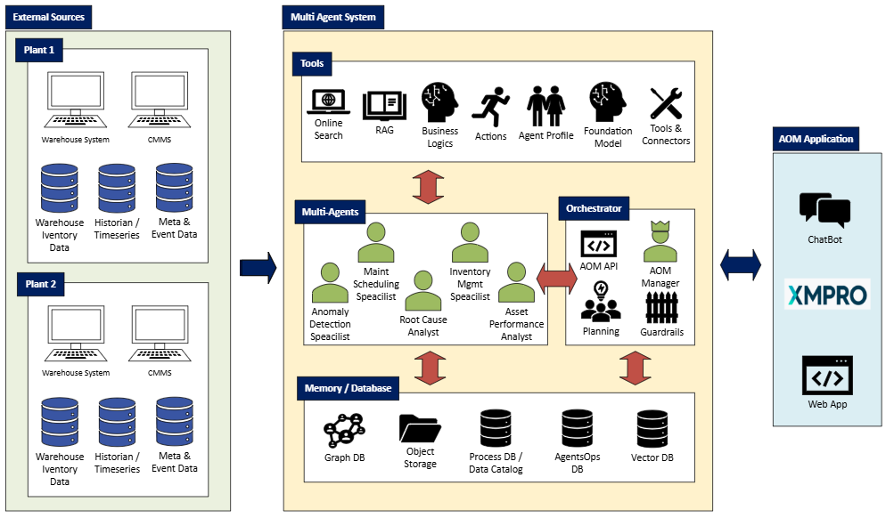
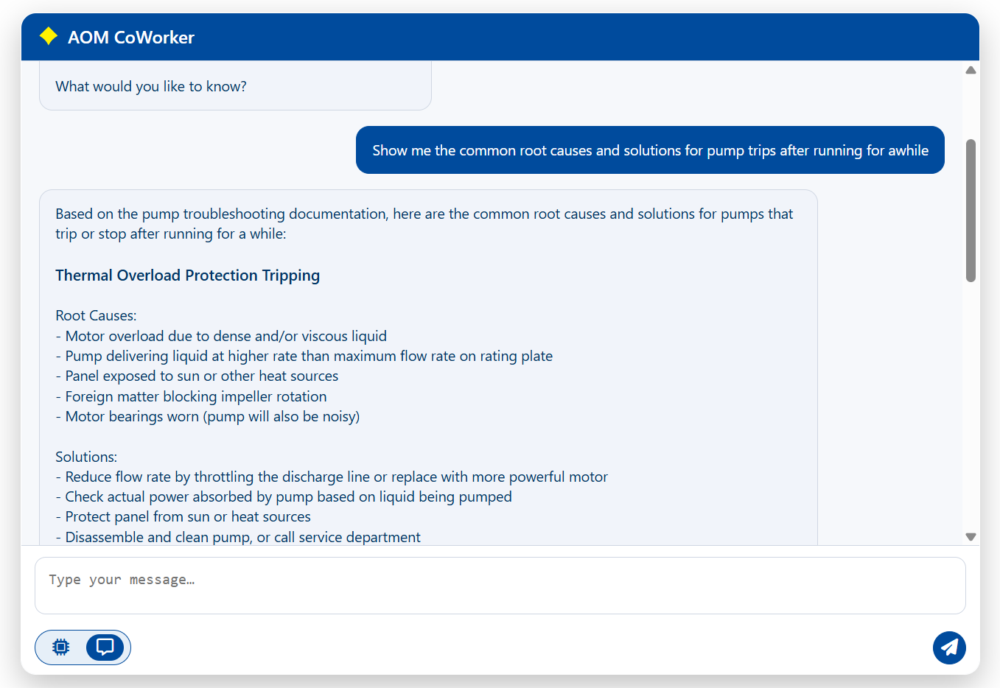
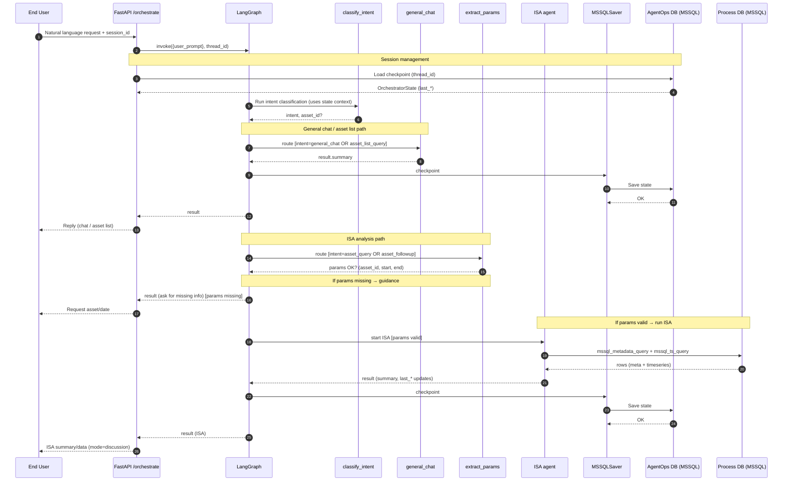

# Multi-Agent System for AOM - Distributed Intelligence. Unified Insight."

> **A multi-agent orchestration platform** for analyzing industrial equipment telemetry, detecting anomalies, and generating actionable insights through the collaboration among specialized expert agents.

[](https://www.python.org/downloads/)
[](https://fastapi.tiangolo.com/)
[](https://fastapi.tiangolo.com/)
[](https://python.langchain.com/)
[](https://docs.anthropic.com/)
---

## System Architecture



*Figure 1: Multi-Agent System Architecture - Picture shows the complete data flow from external sources through the agent orchestration layer to the AOM application interface*

## Product Screenshot


## Architecture Overview

The system consists of four main layers:

1. **External Sources Layer**: Integration with warehouse systems, CMMS, historians, and event data
2. **Multi-Agent System Core**:
   - **Tools & Connectors**: Online search, RAG, business logics, agent profiles, tools & connectors
   - **Multi-Agents**: Specialized agents (ISA, Anomaly Detection, Maintenance Scheduling, etc.)
   - **Orchestrator**: AOM API, Planning, and Guardrails
   - **Memory Layer**: Graph DB, Object Storage, Process DB, Data Catalog, Vector DB (Qdrant), AgentOps DB (MSSQL)
3. **AOM Application**: ChatBot and XMPRO Web App interfaces

---

## MAS Orchestration Pattern:

```mermaid
flowchart TD

%% ====== STYLES ======
classDef agent fill:#e7e0ff,stroke:#b8a8f0,stroke-width:1px,color:#000
classDef human fill:#c4a8ff,stroke:#b8a8f0,stroke-width:1px,color:#000
classDef rag fill:#efe6ff,stroke:#b8a8f0,stroke-width:1px,color:#000
classDef io fill:#9b47d9,stroke:#b8a8f0,stroke-width:1px,color:#000

%% ====== NODES ======
Input(["Input"]):::io

A["Orchestrator Agent <br/>(Q&A, assign agent)"]:::agent
B["ISA Agent<br/>"]:::agent
C["INV Agent <br/>"]:::agent
D["MSA Agent <br/>"]:::agent
E["RCA Agent <br/>"]:::agent
F["RAG Agent <br/>"]:::agent

Human["Human"]:::human
Result(["Result"]):::io

%% ====== POSITIONING ======
Input --> A
A -->|Asset Performance| B
A -->|Inventory Management| C
A -->|Maintenance Scheduling| D
A -->|Root Cause & Solution| E


%% human handoff arrows (curved like sketch)
D -.-> Human
Human -.-> D
E -.-> F
F -.-> E
A -.-> F
F -.-> A

%% completion arrows
A --> Result
B --> Result
C --> Result
D --> Result
E --> Result
````


## Key Features

### Intelligent Agent System
- **Orchestrator Agent**: Intent classification, agent routing, conversation management
- **Information Synthesis Agent (ISA)**: Telemetry aggregation, statistical analysis, risk assessment
- **Specialized Worker Agents**: Anomaly detection, predictive maintenance, inventory management
- **Foundation Models**: Integration with Claude Sonnet 4, local LLMs via MCP

## Agent Architecture (LangChain-Style Specifications)

The MAS-DEV system employs six specialized agents, each designed with specific roles, tools, and policies to handle industrial asset management workflows.

### 1) Maintenance Scheduling Agent (MSA)

**Role**: Convert OEM-defined PM inputs into dated PM schedules + WO drafts.

**Goals**: Optimal PM cadence; minimize downtime; align parts and man power.

**Inputs**:
- `asset_id`, `last_service_date`, `OEM_spec_ref`
- `RUL` (optional), `manpower_roster`, `shift_calendar`

**Outputs**:
- `work_order_draft` (tasks, parts, man-hours, window, hazards, SOP refs)
- `schedule` (dates, headcount, dependencies)

**Tools**:
- `rag_search` (OEM/SOP)
- `text_to_sql` (calendar/resources)
- `cmms_api` (WO draft)
- `physics_models` (if pumps/fans)
- `text_processing`

**Memory**: Recent work orders, asset maintenance history pointers, OEM doc embeddings.

**Policies/Guardrails**: Require human approval to issue WO; cite SOP version; flags conflicts with production calendar.

---

### 2) Inventory Management Agent (INV)

**Role**: Monitor spare parts and consumable availability, provide stock status alerts, and support inventory decision-making.

**Query Modes**:
`Part-specific query` (part_number provided): Detailed information for a specific part
`Asset-specific query` (asset_id provided): All parts compatible with an asset type
`Stock alerts query` (no parameters): All parts with WARNING or CRITICAL stock levels

**Inputs**:
- `asset_id` (required): Asset identifier for asset-type inventory lookup
- `part_number` (required): Specific part number for detailed part information
- `db_profile` (optional): Database profile for an inventory data source

**Outputs**:
- `summary`: Natural language inventory analysis
- `raw_data`: Structured inventory records
- `query`: Query metadata (mode, asset_id, part_number, total_parts)

**Tools**:
- `mssql_inv_query_tool`
- `llm_summarize`
- `mssql_metadata_query_tool`

**Memory**: MPR/WH data; open PRs, supplier SLA, typical consumption rates.

**Policies**: No auto-PR without approval; avoid overbuying if `on_hand + in_transit > max`.

---

### 3) Information Synthesis Agent (ISA)

**Role**: Multi-source retrieval/ETL, summaries, trend packs.

**Inputs**:
- `asset_id` (required): Asset identifier for telemetry lookup
- `start` (required): Analysis period start timestamp (ISO8601 format)
- `end` (required): Analysis period end timestamp (ISO8601 format)
- `signals` (optional): List of telemetry signals to analyze (default: ["temperature_c", "vibration_mm_s", "energy_kwh"])
- `interval` (optional): Aggregation window size (default: "60 m")
- `aggs` (optional): Aggregation functions (default: ["mean", "max", "min"])
- `db_profile` (optional): Database profile for a data source

**Outputs**:
- `summary`: Natural language performance analysis with risk assessment
- `assets` (error case): List of available assets when requested asset not found

**Tools**:
- `mssql_ts_query`
- `mssql_metadata_query`
- `llm_summarize`
- `mssql_ts_date_range`

**Memory**: Cached query plans, data source catalog, embeddings for manuals.

**Policies**: Respect data lineage; mark approximations; respect PII/secret scrubbing.

---

### 4) Root Cause Analysis Agent (RCA)

**Role**: Utilizing knowledge base and historical data, identify root causes and solution of failures..

**Inputs**: `AlertAdditionInfo`, timestamp, alert id, cause, solution `RecommendationAlert`, alert id, title, description, status.

**Outputs**: `AlertAdditionInfo` (update cause and solution columns).

**Tools**:
- `mssql_recom_query` (query, merge and clean alert and recommendation tables)
  - `mssql_metadata_query`, `mssql_ts_query`, `llm_summarize`, `retrieve_context`

**Memory**: Model version, calibration slices, error bounds.

**Policies**: 

---

### 5) Anomaly Detection Agent (ADA)

**Role**: Health index and anomaly detection (live/adhoc).

**Inputs**: `asset_id`, window spec (e.g., "1w", "30d"), thresholds.

**Outputs**: `anomaly_report` (score, events, trends, baseline shifts, spikes).

**Tools**:
- `ml_anomaly`, `ts_query`, `report_export`

**Memory**: Per-asset baseline and seasonal profiles.

**Policies**: Show evidence (score/stats); never alarm without threshold and rationale.

---

### 6) Asset Operations Management Agent (AOM, Orchestrator)

**Role**: Single pane of glass; plan, explain, and approve.

**Inputs**: User prompt/intents, `asset_id`, timeframe.

**Outputs**: Consolidated `asset_overview`, decisions, actions, explainability.

**Tools**: `tools_all`, `mcp`, `report_export`.

**Memory**: Asset knowledge graph pointers; last month's decisions; stakeholder prefs.

**Policies**: Require approvals for WO/PR; attach and cite sources; summarize in business terms, All actions require user confirmation

---


### Agent-to-Database Mapping

| Agent                  | Primary DB          | Secondary DB | Memory Store                              | Implementation Status |
|------------------------|---------------------|--------------|-------------------------------------------|-----------------------|
| **AOM (Orchestrator)** | AgentOps DB (MSSQL) | Process DB   | LangGraph State                           | ✅ **Active**          |
| **ISA**                | Process DB (MSSQL)  | AgentOps DB  | Config Files (agents.yaml, iso10816.json) | ✅ **Active**          |
| **MSA**                | Process DB          | AgentOps DB  | Vector DB (OEM docs)                      | 🔵 Planned            |
| **INV**                | Process DB (MSSQL)  | AgentOps DB  | Config Files (agents.yaml)                | ✅ **Active**          |
| **PMA**                | Process DB          | AgentOps DB  | Vector DB (models)                        | 🔵 Planned            |
| **ADA**                | Process DB          | AgentOps DB  | Vector DB (baselines)                     | 🔵 Planned            |

#### Detailed Agent Database Usage

**AOM (Asset Operations Management - Orchestrator)** - ✅ Active
- **Primary:** AgentOps DB (MSSQL)
  - Stores LangGraph checkpoints (`langgraph_checkpoints` table)
  - Tracks session state via `MSSQLSaver` checkpointer
  - Log agent runs and tool usage
- **Secondary:** Process DB (MSSQL)
  - Reads asset lists for validation
- **Memory:** LangGraph `OrchestratorState` (in-memory + persisted)
  - `last_asset_id`, `last_start_date`, `last_end_date`
  - `last_isa_result`, `mode`, `conversation_history`

**ISA (Information Synthesis Agent)** - ✅ Active
- **Primary:** Process DB (MSSQL)
  - `asset_meta` table: Asset metadata (maker, rated_power_Kw, rated_voltage_v)
  - `asset_data` table: Time-series telemetry (temperature_c, vibration_mm_s)
- **Secondary:** AgentOps DB (MSSQL)
  - Execution logs written by orchestrator
- **Memory:** File-based configuration
  - `aom/config/agents.yaml`: Prompts, model settings
  - `aom/policy/iso10816.json`: Vibration standards
  - **Note:** No Vector DB for manuals (uses static JSON policies)

**MSA (Maintenance Scheduling Agent)** - 🔵 In Progress
- **Primary:** Process DB (MSSQL)
  - Work orders, maintenance schedules, SOP references
- **Secondary:** AgentOps DB
  - Audit trails for scheduled maintenance
- **Memory:** Vector DB (future)
  - OEM documentation embeddings
  - Historical maintenance patterns

**INV (Inventory Management Agent)** - ✅ Active
- **Primary:** Process DB
  - `asset_inv` table: part_number, part_name stock, min/max stock level, supplier, lead time, asset_type
- **Secondary:** AgentOps DB (MSSQL)
  - Execution logs written by orchestrator
- **Memory:** File-based configuration
  - `aom/config/agents.yaml`: Prompts, model settings

**RCA (Root Cause Analysis Agent)** - 🔵 In progress
- **Primary:** Process DB, Vector DB
  - Knowledge base, historical data
  - Service history, failure patterns
- **Secondary:** AgentOps DB
  - Model inference logs, prediction accuracy

**ADA (Anomaly Detection Agent)** - 🔵 Planned
- **Primary:** Process DB
  - Real-time sensor data, threshold configurations
- **Secondary:** AgentOps DB
  - Anomaly event logs, alert history
- **Memory:** Vector DB (future)
  - Per-asset baseline profiles, seasonal patterns

---

### Agents Interaction Flow
```mermaid
flowchart TD
    U[End User] -->|Natural language request + session_id| API{{FastAPI /orchestrate}}

    subgraph Session_Management
    direction TB
    SM1[Load LangGraph checkpoint from AgentOps DB]
    SM2[Restore OrchestratorState]
    SM3[Extract: last_asset_id, last_start_date,<br/>last_end_date, last_isa_result,<br/>last_inv_result]
    SM1 --> SM2 --> SM3
    end

    API --> Session_Management
    Session_Management --> ORCH{{AOM Orchestrator}}

    subgraph Orchestrator_Logic
    direction TB
    A1[1. Intent Classification<br/>Uses state context]
    A2[2. Check intent result]
    A3[3. Route to appropriate handler]
    A1 --> A2 --> A3
    end

    ORCH --> Orchestrator_Logic

    Orchestrator_Logic -->|Intent: general_chat| CHAT[General Chat Node<br/>List Assets detail]
    Orchestrator_Logic -->|Intent: asset_list_query| CHAT
    Orchestrator_Logic -->|Intent: asset_query| EXTRACT_ISA[Extract ISA Params Node<br/>Parse dates, validate asset]
    Orchestrator_Logic -->|Intent: asset_followup| EXTRACT_ISA
    Orchestrator_Logic -->|Intent: inventory_query| EXTRACT_INV[Extract INV Params Node<br/>Parse asset_id/part_number]

    EXTRACT_ISA -->|Valid params| ISA[ISA Agent]
    EXTRACT_ISA -->|Invalid asset| CHAT
    
    EXTRACT_INV -->|Has params OR stock alert| INV[INV Agent]
    EXTRACT_INV -->|Missing params| CHAT

    subgraph ISA_Execution
    direction TB
    I1[Validate asset exists<br/>mssql_metadata_query]
    I2[Fetch timeseries data<br/>mssql_ts_query]
    I3[Compute statistics<br/>min/max/mean/trend]
    I4[Generate summary<br/>llm_summarize Claude]
    I1 --> I2 --> I3 --> I4
    end

    subgraph INV_Execution
    direction TB
    V1[Fetch inventory data<br/>mssql_inv_query]
    V2{Query Mode?}
    V3[Mode 1: Filter by part_number]
    V4[Mode 2: Filter by asset_type<br/>via metadata lookup]
    V5[Mode 3: Calculate stock status<br/>Filter WARNING/CRITICAL]
    V6[Generate summary<br/>llm_summarize Claude]
    V1 --> V2
    V2 -->|part_number| V3 --> V6
    V2 -->|asset_id| V4 --> V6
    V2 -->|stock alert| V5 --> V6
    end

    ISA --> ISA_Execution
    INV --> INV_Execution

    ISA_Execution --> UPDATE_ISA{{Update ISA State}}
    INV_Execution --> UPDATE_INV{{Update INV State}}

    subgraph State_Update_ISA
    direction TB
    U1[Update last_isa_result]
    U2[Update last_asset_id]
    U3[Update last_start_date, last_end_date]
    U4[Update mode: analysis/discussion]
    U1 --> U2 --> U3 --> U4
    end

    subgraph State_Update_INV
    direction TB
    N1[Update last_inv_result]
    N2[Update last_asset_id if provided]
    N3[Update last_inv_timestamp]
    N4[Update mode: discussion]
    N1 --> N2 --> N3 --> N4
    end

    UPDATE_ISA --> State_Update_ISA
    UPDATE_INV --> State_Update_INV
    CHAT --> SAVE

    State_Update_ISA --> SAVE{{Save Checkpoint}}
    State_Update_INV --> SAVE

    subgraph Checkpoint_Save
    direction TB
    S1[LangGraph checkpointer]
    S2[Write to AgentOps DB MSSQL]
    S3[Store OrchestratorState as checkpoint]
    S1 --> S2 --> S3
    end

    SAVE --> Checkpoint_Save
    Checkpoint_Save --> RESP[Return Response to User]
    RESP --> U

    subgraph Databases_Used
    direction LR
    DB1[(AgentOps DB<br/>MSSQL)]
    DB2[(Process DB<br/>MSSQL)]
    DB3[(Vector DB<br/>NOT USED)]
    end

    Session_Management -.->|Read checkpoint| DB1
    Checkpoint_Save -.->|Write checkpoint| DB1
    ISA_Execution -.->|Query timeseries & metadata| DB2
    INV_Execution -.->|Query inventory & metadata| DB2

    style DB3 fill:#331111,stroke:#661111,stroke-dasharray: 5 5
    style Session_Management fill:#1a3a52
    style Orchestrator_Logic fill:#2d4a5e
    style ISA_Execution fill:#3a5a3a
    style INV_Execution fill:#5a3a5a
    style State_Update_ISA fill:#4a4a2d
    style State_Update_INV fill:#4a2d4a
    style Checkpoint_Save fill:#1a3a52
    style U fill:#ffeb3b,stroke:#f57f17,stroke-width:2px,color:#000
    
```

### Sequence Diagram Example for Performance Analysis Agent / ISA



### Request Flow Explanation

**Step 1: Session Loading**
- FastAPI passes `prompt` and optional `session_id` to Orchestrator
- Build `thread_id` using format `ENV-session_id` or `ENV-sess-<ULID>`
- LangGraph loads checkpoint from **AgentOps DB (MSSQL)** using `thread_id`
- Restores `OrchestratorState` containing conversation context

**Step 2: Intent Classification**
- Intent Class
    - `general_chat`: General conversation, greetings, or questions not requiring asset analysis
    - `asset_list_query`: User is asking for a list of available assets
    - `asset_query`: User wants to perform a new asset performance analysis (requires asset_id + date range)
    - `asset_followup`: User is asking a follow-up question about a previous analysis
- Orchestrator classifies intent using **state context**:
  - `last_asset_id`: Previously discussed asset
  - `last_start_date`, `last_end_date`: Previous date range
  - `last_isa_result`: Last analysis result for discussion
  - `mode`: "analysis" or "discussion"
  - flag `asset_list` requests with deterministic check

**Step 3: Routing Decision**
- `general_chat` / `asset_list_query` → General Chat Node
- `asset_query` / `asset_followup` → Extract Params
  - if params incomplete → return guidance (END)
  - if params valid → ISA Agent

**Step 4: ISA Execution** (if routed)
- Validate asset exists via `mssql_metadata_query` (**Process DB**)
- Query timeseries data via `mssql_ts_query` (**Process DB**)
- Compute statistics (min/max/mean/trend)
- Generate natural language summary via `llm_summarize` (Claude)
- Orchestrator stores result and set `mode` to "discussion"

**Step 5: State Update**
- Update `last_isa_result` with new summary
- Update `last_asset_id`, `last_start_date`, `last_end_date`
- Set `mode` to "discussion" for follow-up questions

**Step 6: Checkpoint Save**
- LangGraph checkpointer writes updated state to **AgentOps DB (MSSQL)** via checkpointer
- Next request with same `session_id` will load this updated state

---

### Hybrid Memory Architecture

| Database                | Purpose                                                                       | Use Case                                                                                                                                                                                                                                                      | Status         |
|-------------------------|-------------------------------------------------------------------------------|---------------------------------------------------------------------------------------------------------------------------------------------------------------------------------------------------------------------------------------------------------------|----------------|
| **AgentOps DB** (MSSQL) | LangGraph checkpoint storage, session state persistence, agent execution logs | • Stores `OrchestratorState` (last_asset_id, last_start_date, last_isa_result)<br/>• Session checkpointing via `MSSQLSaver`<br/>• Agent runs tracking (`agent_runs` table)<br/>• Tool usage logs (`agent_tools_usage` table)<br/>• Audit trails and analytics | ✅ **Active**   |
| **Process DB** (MSSQL)  | Operational data, telemetry storage, asset meta data.                         | • Asset metadata (`asset_meta` table)<br/>• Time-series telemetry (`asset_data` table)<br/>• KPIs, work orders, reports<br/>• Read-only queries from ISA and other agents                                                                                     | ✅ **Active**   |
| **Data Catalog**        | Schema registry, data lineage, quality metrics                                | • Column-level metadata<br/>• Data source freshness tracking<br/>• Lineage for compliance                                                                                                                                                                     | ⚠️ **Planned** |
| **Vector DB** (Qdrant)  | Semantic search, conversational memory (future)                               | • RAG context for OEM manuals, and handbook<br/>• *(Future)* Similar conversation retrieval<br/>• *(Future)* Embedding-based asset search<br/>                                                                                                                | ✅ **Active**   |

#### Current Implementation Details

**AgentOps DB Tables (Active):**
- `agent_sessions`: Session metadata with status tracking
- `agent_runs`: Individual agent execution records
- `conversation_messages`: Message history (not used for context retrieval)
- `agent_tools_usage`: Tool invocation logs with parameters
- `agent_performance_metrics`: Pre-computed analytics
- `langgraph_checkpoints`: LangGraph state snapshots (auto-managed)

**Session Context Storage:**
- **Current:** Structured fields in `OrchestratorState` TypedDict
- **Persisted via:** LangGraph `MSSQLSaver` checkpointer
- **Context Fields:**
  ```
  {
    "last_asset_id": str,           # Previously discussed asset
    "last_start_date": str,         # Previous query start date
    "last_end_date": str,           # Previous query end date  
    "last_isa_result": str,         # Last ISA analysis summary
    "mode": str,                    # "analysis" or "discussion"
    "conversation_history": list    # Recent messages
  }
  ```
  
---

## RAG Pipeline & Flow
- Extraction, Chunking, Embedding, and Retrieval are split into three algorithms.
- Extraction: `pdf_extract.py` Detects layout, extracts text into Markdown, and saves tables as images.
- Chunking/Embedding: `ingest.py` splits Markdown pages and tables into sections by headings, embeds them using sentence-transformers, and upserts the vectors and metadata to Qdrant for indexing (storage and optimization).
- Retrieval: `retrieve.py` Performs query embedding, semantic search, and retrieval.
- Semantic search is used by the Orchestrator Agent and the RCA Agent.
- `QdrantConnector` class is implemented (`aom/tools/qdrant_connect.py`)


---


## 📁 Project Structure

### Key Directories Explained

| Directory             | Purpose                    | Key Files                                            |
|-----------------------|----------------------------|------------------------------------------------------|
| **`aom/agents/`**     | Agent implementations      | `orchestrator.py`, `isa.py`, `rca.py`, `inv.py`      |
| **`aom/mcp_server/`** | Tool server (MCP protocol) | `server.py`                                          |
| **`aom/tools/`**      | Agent's Tool & Integration | `llm_summarizer.py`, `sql_connect.py`, `retrieve.py` |
| **`aom/utils/`**      | Utilities & Helpers        | `utilities.py`, `agent_helpers.py`, `graph.py`       |
| **`aom/services/`**   | Business logic             | `asset_catalog.py`, `extractor.py`,                  |
| **`aom/webui/`**      | Chatbot webpage            | `index.html`, `index_dark.html`, `index_light.html`  |
| **`config/`**         | Configuration & prompts    | `agents.yaml`, `sql_config.yaml`                     |
| **`docker/`**         | Containerization           | `Dockerfile`, `docker-compose.yml`                   |
| **`reverse_proxy/`**  | Web server configs         | `Caddyfile`                                          |

---

## Quick Start

### Prerequisites
- Python 3.12+
- Microsoft ODBC Driver 18 for SQL Server installed on the host
- MSSQL Server instance (local or remote) to store and retrieve conversation history and processed data
- Anthropic API key for Claude foundational model usage
- Qdrant Server and API key to store and retrieve semantic vectors

### Installation
- PIP install from requirements.txt
- Activate environments
- Make sure data source / database are available
---

## AgentOps Database Schema

The AgentOps database tracks all agent operations, sessions, and performance metrics. Key tables:

- **`checkpoint`**: User conversation sessions with status tracking
- **`checkpoint_write`**: Individual agent executions (ISA, Orchestrator, etc.)
- **`conversation_messages`**: Structured message history with vector DB links
- **`agent_tools_usage`**: Tool invocation logs (DB queries, API calls)

Full DDL available in `doc/agentops_schema.sql`

---

## Tools & Integrations

| Tool                     | Description                          | MCP Function                                 |
|--------------------------|--------------------------------------|----------------------------------------------|
| **mssql_ts_query**       | Time-series telemetry aggregation    | Fetches sensor data with windowing           |
| **mssql_metadata_query** | Asset nameplate/location lookup      | Returns equipment details                    |
| **llm_summarize**        | LLM text generation                  | Calls Claude or local model                  |
| **mssql_inv_query**      | Part inventory data                  | Fetches parts data                           |
| **context_retrieve**     | Context retrival from knowledge base | Retrieve relevant information from vector DB |

---

## Monitoring & Observability

### Health Check
```bash
curl http://localhost:8080/health

# Response:
{
  "status": "ok",
  "qdrant": {
    "connected": true,
    "collections": ["conversation_memory"]
  }
}
```

## API Usage

### Endpoint: `/orchestrate`

#### Request
```bash
curl -X POST [http://localhost:8080/orchestrate](http://localhost:8080/orchestrate)
-H "Content-Type: application/json"
-d '{ "prompt": "Show me the performance of motor_1 last week", "session_id": "optional-session-id" }'
```
#### Response
```
json { "response": "Here's the performance analysis for motor_1...", "session_id": "abc-123-xyz", "agent_used": "ISA", "tools_invoked": ["mssql_ts_query", "llm_summarize"], "confidence": 0.95 }
```
---
## Configuration

### Environment Variables

| Variable            | Description                              | Required    |
|:--------------------|:-----------------------------------------|:------------|
| `MSSQL_LOCAL_USER`  | Database username                        | ✅ Yes       |
| `MSSQL_LOCAL_PWD`   | Database password                        | ✅ Yes       |
| `ANTHROPIC_API_KEY` | Claude API key                           | ✅ Yes       |
| `QDRANT_API_KEY`    | Qdrant authentication                    | ✅ Yes       |
| `LOG_LEVEL`         | Logging verbosity (DEBUG, INFO, WARNING) | ⚠️ Optional |
| `LOG_DIR`           | Log file directory                       | ⚠️ Optional |

### Configuration Files

All configuration files are located in `aom/config/`:

- **`sql_config.yaml`**: Database connection profiles
- **`llm_config.yaml`**: LLM model settings & API keys
- **`qdrant_config.yaml`**: Vector DB configuration
- **`agents.yaml`**: Agent prompts & personalities
- **`api_config.yaml`**: External API endpoints
- **`rag_config.yaml`**: Config for extract/chunking, embedding, and retrieval

## Technology Stack

### Core Technologies

| Category            | Technology           | Purpose                               |
|:--------------------|:---------------------|:--------------------------------------|
| **Language**        | Python 3.12+         | Runtime environment                   |
| **App Framework**   | FastAPI              | API server                            |
| **Agent Framework** | LangGraph, LangChain | Agent orchestration                   |
| **Database**        | MSSQL Server         | Transactional and conversational data |
| **Vector DB**       | Qdrant               | RAG database                          |
| **LLM**             | Anthropic Claude     | Text generation and classification    |


## Contributors
| Name       | GitHub                                    | Area                                  |
|------------|-------------------------------------------|---------------------------------------|
| Aaron Kueh | [@aaronkueh](https://github.com/AaronKHK) | Architecture Design & App Development |
